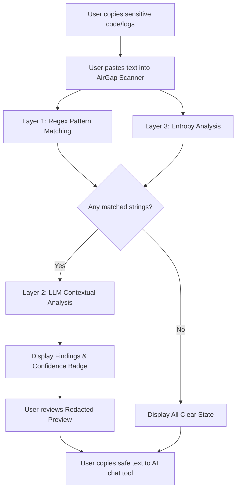
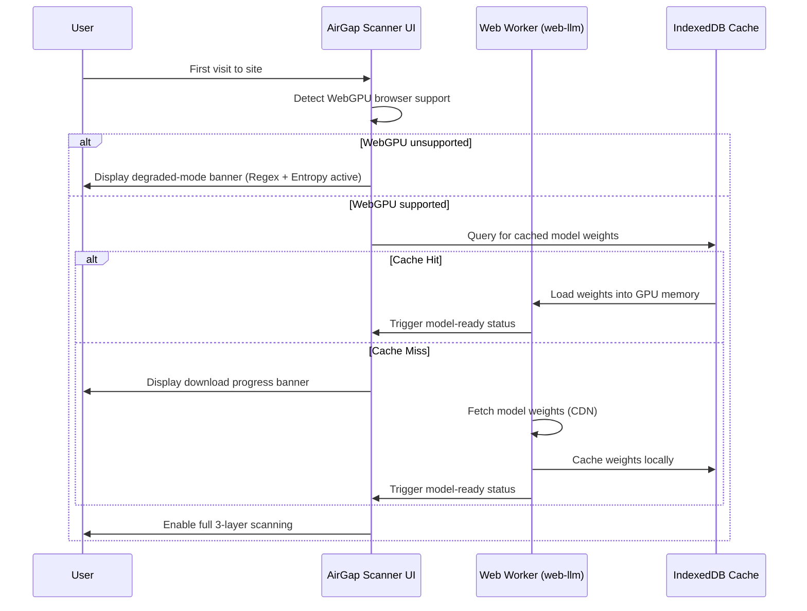
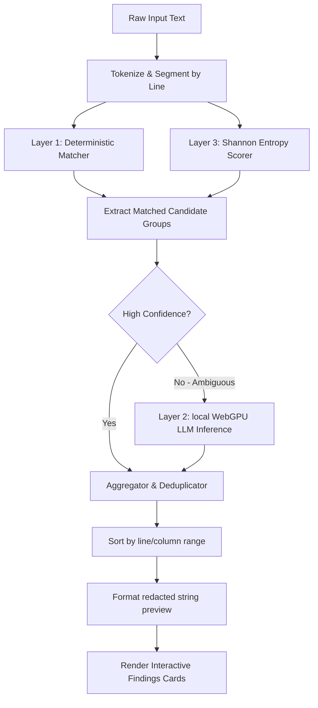

# 🛡️ AirGap Scanner

### Zero-Trust, On-Device Secret Detection

AirGap Scanner is a fully client-side web application designed to scan pasted text—code snippets, configuration files, error traces, and deployment logs—for live secrets and credentials **before** they leave your browser and enter third-party AI chat tools or external servers.

---

## 📖 Executive Summary

Organizations increasingly rely on AI-powered chat tools (such as ChatGPT, Claude, and GitHub Copilot Chat) to accelerate software development. Every day, developers paste code, error traces, and logs containing live API keys, database credentials, or authentication tokens into these tools without realizing the risk. Once submitted, those credentials leave the local machine, creating direct paths to account takeovers, data breaches, and compliance violations.

**AirGap Scanner** solves this problem by executing all scan operations **entirely in the user's browser**. It combines three independent detection layers—deterministic pattern matching (100+ patterns), Shannon entropy analysis (to catch unstructured randomness), and a quantized local Large Language Model (LLM) running in-browser via WebGPU—to deliver comprehensive secret detection with **zero network calls**. Nothing pasted into the application is ever transmitted, persisted, or logged.

---

## 🚀 Key Features

*   **Zero-Trust Client-Side Isolation**: All detection logic runs locally. Content Security Policy (CSP) headers block outbound XHR, fetch, and WebSocket connections during scans.
*   **Three-Layer Hybrid Detection Engine**:
    1.  **Layer 1 (Regex Engine)**: Deterministic matching against 100+ high-fidelity secret patterns modeled on Gitleaks and TruffleHog rulesets.
    2.  **Layer 2 (LLM Contextual Verification)**: Context-aware analysis of ambiguous findings using a quantized local model (e.g., Phi-3.5 Mini) executing via WebGPU.
    3.  **Layer 3 (Entropy Engine)**: Shannon entropy calculations combined with variable assignment signals to catch unstructured high-randomness credentials.
*   **Progressive Enhancement & Graceful Fallbacks**: If WebGPU is unavailable (e.g., on unsupported browser engines), the app gracefully degrades to regex and entropy scanning with zero UI disruption.
*   **Redacted Preview**: One-click copy of sanitized text with masked placeholders (e.g., `[REDACTED-AWS-KEY]`).
*   **Privacy First**: Pasted text is never stored in `localStorage`, `sessionStorage`, or database caches. Active sessions reside strictly in transient browser memory.

---

## 🎨 Design System & Aesthetics

AirGap Scanner is designed with a premium, security-centric interface built using custom CSS variables (tokens) and a cohesive dark palette:

*   **Primary Palette**: High-contrast slate and cyan tones optimized for readability and visual flow.
*   **Semantic Accents**:
    *   🟢 **Success / Safe**: Green accents indicate no secrets detected.
    *   🟡 **Warning / Low Confidence**: Amber warnings flag suspicious, high-entropy strings requiring inspection.
    *   🔴 **Error / Exposed Secret**: Red warnings identify validated credentials matching known patterns.
    *   🔵 **Info / Active Scan**: Blue badges indicate background processes and scanner status.

---

## 🔄 Business Workflows & Pipeline Processes

### 1. Paste-and-Scan Workflow
The checkpoint process inserting a zero-trust audit layer between the clipboard and AI engines:



### 2. First-Visit Model Loading
How on-device AI weights are downloaded, verified, and cached transparently without blocking the main thread:



### 3. Pipeline Detection & Aggregation
How findings are collected, ranked, and deduplicated before presenting to the user:



---

## 🛠️ Technology Stack

*   **Core**: React 18, TypeScript 5, Vite 5
*   **Styling**: Custom CSS Variables, Tailwind CSS (for structure/layout)
*   **AI Inference**: `@mlc-ai/web-llm` running quantized model weights on WebGPU
*   **Storage**: IndexedDB (strictly for caching local LLM model weights)
*   **Security Gating**: Content Security Policy (CSP), SonarQube, Snyk, Semgrep

---

## 📂 Repository Structure

```
airgap-scanner/
├── .github/             # GitHub workflow pipelines
├── docs/                # Project documentation and ADRs
│   ├── adr/             # Architecture Decision Records
│   ├── compliance/      # Compliance and data classification guidelines
│   ├── data-classification.md
│   ├── demo-script.md
│   └── user-guide.md
├── public/              # Static assets and Netlify headers
├── src/                 # Application source code
│   ├── components/      # UI components (ScannerLayout, ResultsPanel, VerdictBanner)
│   ├── config/          # Security headers & CSP configuration
│   ├── contexts/        # React Theme and App State Contexts
│   ├── engines/         # Secret detection engines (RegexEngine, EntropyAnalyzer)
│   ├── hooks/           # State and interaction hooks (useScanEngine, useClipboard)
│   ├── infra/           # WebGPU detectors, cache managers, logging
│   ├── styles/          # Design tokens and custom theme stylesheets
│   └── workers/         # LLM worker prompt template and processing script
└── tests/               # Playwright E2E and Vitest verification suites
```

---

## ⚙️ Getting Started

### Prerequisites

Ensure you have [Node.js](https://nodejs.org/) (v20 or higher) and `npm` installed.

### Installation

1.  Clone the repository:
    ```bash
    git clone https://github.com/Keerthik-DU/Hack.git airgap-scanner
    cd airgap-scanner
    ```
2.  Install dependencies:
    ```bash
    npm install
    ```

### Running Locally

To start the Vite local development server:
```bash
npm run dev
```
Open [http://localhost:5173/](http://localhost:5173/) in your browser. (The local server will automatically bypass strict CSP meta tags to ensure WebGPU weights and HMR load cleanly).

To preview the built production package locally:
```bash
npm run build
npm run preview
```
This runs the production bundle served on port `4173` with full HTTP security response headers active.

---

## 🧪 Verification & Testing

### Unit and Integration Tests

We use **Vitest** to run unit and integration tests.
```bash
npm run test
```
To run tests with code coverage reporting:
```bash
npm run test:coverage
```

### End-to-End (E2E) Browser Tests

We use **Playwright** to test browser actions, zero-network exfiltration constraints, and security headers.
```bash
# Install Playwright browser executables (if running E2E tests for the first time)
npx playwright install

# Run all Playwright tests
npm run test:e2e

# Run network-isolation tests (verifying zero outbound requests during scan operations)
npm run test:e2e:network
```

---

## 📝 Compliance & Data Policies

*   **Zero Retention**: Pasted user text is stored only in transient heap memory during active browser sessions. Closing the tab immediately destroys all user inputs.
*   **Network Isolation**: Outbound networking is limited via CSP response headers. Outbound connections are blocked entirely once the model weights are retrieved on first visit.
*   **Permissive Licensing**: Bundled model dependencies (e.g., Phi-3.5 Mini) run under open-source MIT or Apache-2.0 licenses, ensuring compliance with commercial redistribution.
